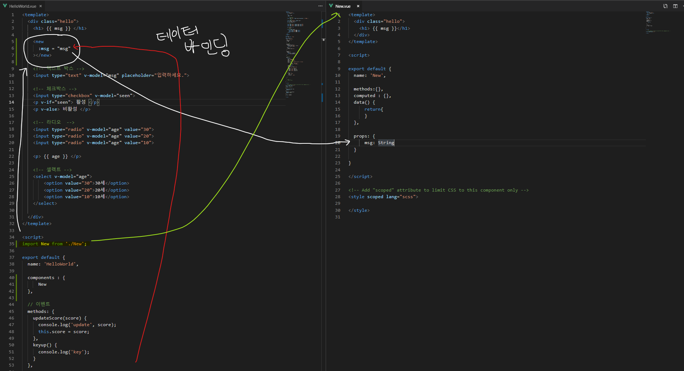

## 탬플릿 
- 탬플릿 태그에는 최상위 div 만 들어갈 수 있음.

## 디렉티브
- v-if : 조건
- v-else : 조건
- v-else-if : 조건
- v-show : 조건(css만 바꿈)
- v-bind:href : 링크
- :href : v-bind 생략
- v-bind:class : 클래스의 속성을 제어
- v-bind:style : 스타일시트 속성을 제어
- v-for : 반복루프
- v-for(val, key, index) : for 를 세분화
- 이벤트 : methods 객체와 맵핑
- 이벤트 (this)


- computed : 데이터를 바인딩하는 다른 방법
- v-model : 데이터와 양방향 바인딩

## 컴포넌트
- 각각 .vue 확장자를 가진 파일을 컴포넌트라고 하는 것 같다.
- 컴포넌트들 간에 상속을 할 수있다.


## 라우터
- URL 에 대한 요청을 라우터에서 담당한다.

```
import Vue from 'vue'
import Router from 'vue-router'
import Intro from '@/components/Intro'
import Day from '@/components/Day'
import Calendar from '@/components/Calendar'
import Setting from '@/components/Setting'
import About from '@/components/About'

Vue.use(Router)

export default new Router({
  mode: 'history',
  base: process.env.BASE_URL,
  routes: [
    {
      path: '/',
      name: 'intro',
      component: Intro
    },
    {
      path: '/day/:date',
      name: 'day',
      component: Day
    },
    {
      path: '/calendar',
      name: 'calendar',
      component: Calendar
    },
    {
      path: '/setting',
      name: 'setting',
      component: Setting
    },
    {
      path: '/about',
      name: 'about',
      component: About
    }    
  ]
})
```

각 path(URL) 요청에 따라 각 컴포넌트들을 매칭한다. import 시 @ 는 **프로젝트의 최상위** 경로를 의미한다.


## 네비게이션 만들기
- 아이콘 팩 설치
npm i xeicon --save

- 아이콘팩 import

### main.js
```
import Vue from 'vue'
import App from './App.vue'
import router from './router'
import store from './store'

Vue.config.productionTip = false

import 'xeicon'

new Vue({
  router,
  store,
  render: h => h(App)
}).$mount('#app')
```

- Nav 컴포넌트 생성
### Nav.vue
```
<template>
  <nav class="nav">
    <ul class="nav-list">
        <li>
            <button @click="today">
                <i class="xi-home"></i>
                <span>오늘</span>     
            </button>
        </li>       
        <li>
            <router-link to="/calendar">
                <i class="xi-calendar"></i>
                <span>달력</span>
            </router-link>
        </li>
        <li>
            <router-link to="/setting">
                <i class="xi-cog"></i>
                <span>설정</span>
            </router-link>
        </li>                
        <li>
            <router-link to="/about">
                <i class="xi-message"></i>
                <span>소개</span>
            </router-link>
        </li>
    </ul>
  </nav>
</template>
```

- Nav 컴포넌트 연결
### App.vue
```
<template>
  <div id="app">
    <Nav></Nav>
    <router-view/>
  </div>
</template>


<script>

import Nav from '@/components/Nav'

export default {
  components : {
    Nav
  }
}

</script>

<style lang="scss" src="./assets/css/style.scss"> </style>
```

- 달력 컴포넌트 (moment) 설치
npm i moment --save

- 컴포넌트 연결 및 사용
### Nav.vue
```
<script>
import moment from 'moment'

export default {
  name: 'Nav',
  methods:{
      today() {
         let todayUrl = '/day/' + moment(new Date()).format('YYYY-MM-DD');
        //  console.log(todayUrl);
        this.$router.push(todayUrl);

      }
  },
  computed : {},
  data() {
      return{
      }
  },

  props: {
      msg: String
  }

}
</script>
```

## 구글 firebase 호스팅 연결.

1. firebase CLI 도구 설치
- npm install -g firebase-tools

2. 구글 firebase 로그인
- firebase login

3. firebase 호스팅 시작하기.  
- firebase init
  
  * 선택
    - Hosting
    - 프로젝트 선택
    - 엔터
    - No
    - No

  * 완료 : firebase.json 파일 생성됨.
  

- firebase.json
```
{
  "hosting": {
    "public": "./dist",
    "ignore": [
      "firebase.json",
      "**/.*",
      "**/node_modules/**"
    ],
    "rewrites": [{
      "source":"**",
      "destination":"/index.html"
    }]
  }
}
```

4. 프로젝트 빌드 및 배포
- npm run build

- firebase deploy

5. npm run 명령어로 등록 : build 와 배포를 동시에 하기.
- package.json
  
  - npm run deploy

## 구글 firebase Database 시작하기
1. 포스트맨 설치
https://www.getpostman.com/downloads/

2. REST API 테스트1 - 데이터 저장하기


3. permmsion 오류 시 보안규칙 추가


4. REST API 테스트2 - 데이터 읽어오기


## 오늘 목록을 데이터 베이스에 요청하기.
1. axios 설치 : 서버에 url 요청
```
npm i axios
```

2. 


